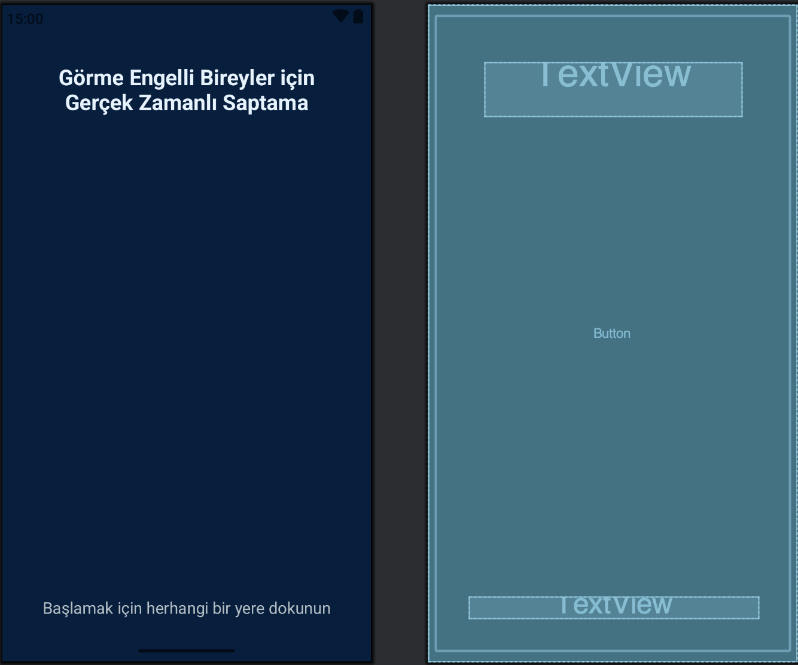
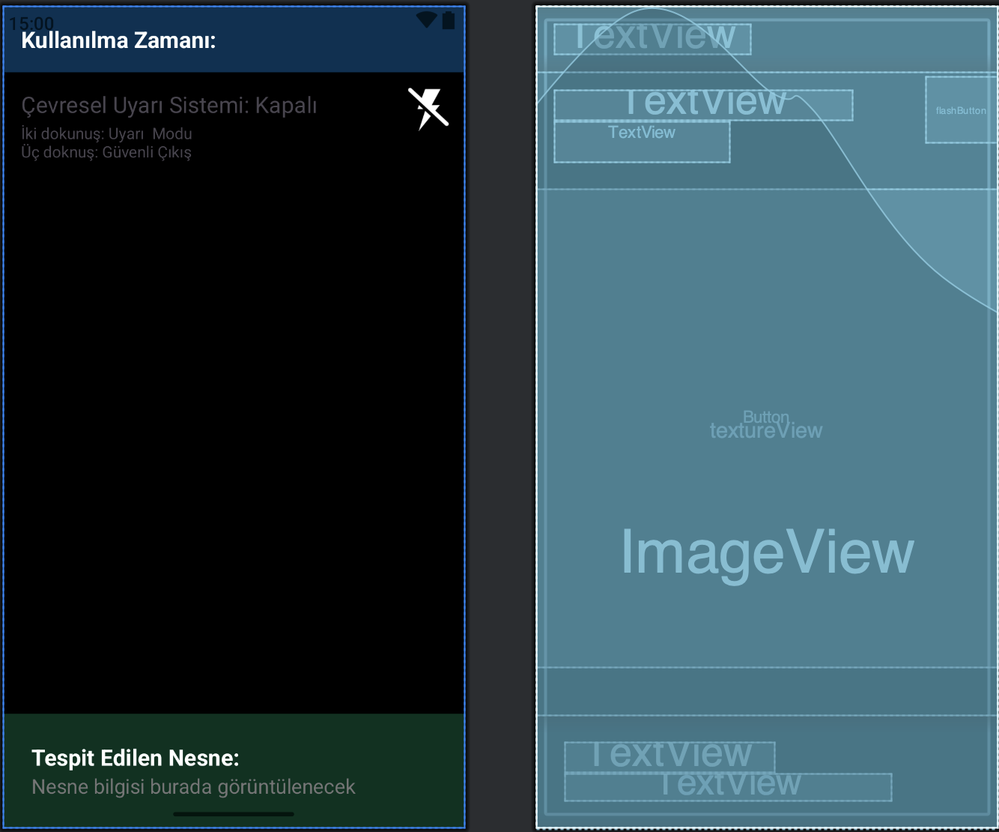
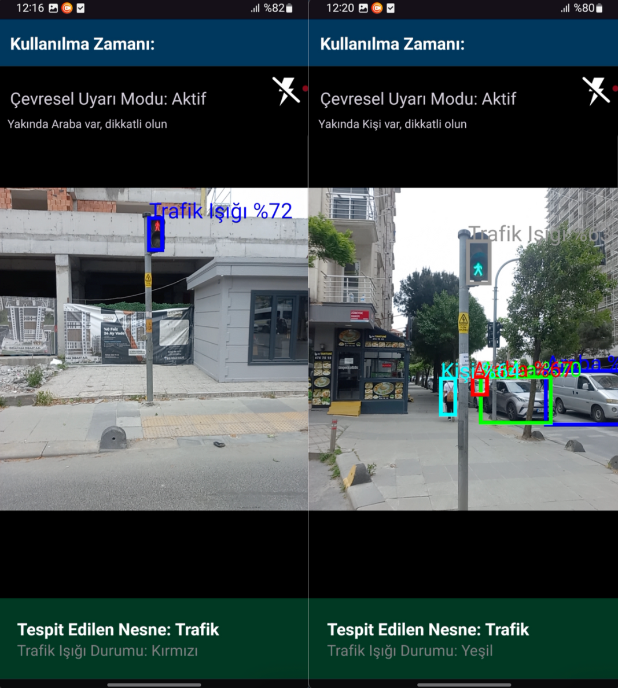
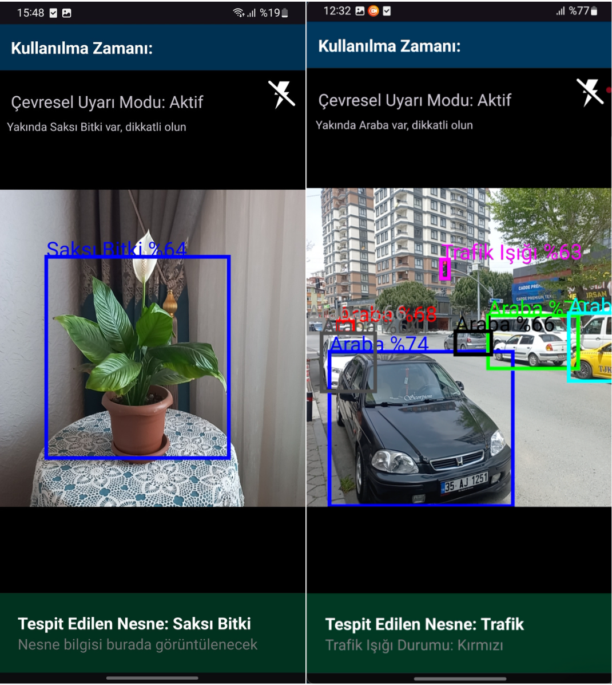

# VisionAid - AI-Powered Assistant for the Visually Impaired 👁️‍🗨️

A mobile application built to support visually impaired individuals in navigating their environment safely and independently. The app integrates real-time object detection, traffic light classification, and full voice feedback using machine learning technologies.

## 🚀 Features

- 🔊 **Voice-Driven Interface**: Start the app with a single touch, no need to see the screen.
- 💡 **Automatic Flashlight**: Detects ambient light and turns on flashlight when needed.
- 🚦 **Traffic Light Recognition**: Detects red or green lights and announces the result using voice.
- 🦺 **Environmental Object Detection**: Double-tap the screen to activate "Safe Mode" which scans and announces nearby objects.
- ✋ **Safe Exit**: Triple-tap for secure exit from the application.
- 🎯 **Optional Object Detection Mode**: On-demand object identification around the user.
- 🎨 **Minimal & Accessible UI**: Clean, voice-guided design optimized for accessibility.

## 🧠 Technologies Used

- **TensorFlow Lite** – Model deployment on Android
- **SSD MobileNet V1** – Real-time object detection
- **Custom CNN Model** – For traffic light classification
- **Kotlin** – Android development
- **OpenCV** – Image processing
- **Text-to-Speech (TTS)** – For all voice feedback

## 📸 Screenshots

| Startup Screen | Traffic Light Detection | Object Detection | Safe Mode Active |
|----------------|-------------------------|------------------|------------------|
|  |  |  |  |
